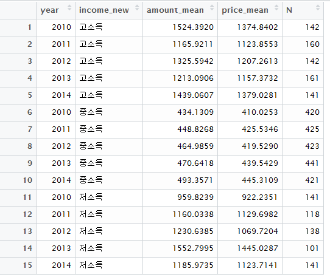

#프로젝트 개요
##소비자 가구 구매패턴 분석

- 주요 농식품에 대한 소비자 가구 구매패턴 분석을 매년 실시하는 한편 시계열 자료를 이용하여 구매행태의 변화와 변화원인을 분석하고 그 결과를 책자료 발간

##조사항목

- 쌀, 두류, 쇠고기, 돼지고기, 닭고기, 계란, 우유, 수박,딸기, 토마토, 참외, 오이, 배추, 상추, 버섯, 사과, 감귤류, 포도, 감, 복숭아, 장류
- 연도별, 월별, 구입처별, 소득계층별, 연령별, 주부취업별, 브랜드별, 친환경 유형별 구입액 및 구입규격 구매빈도

##조사내용

###소비자 가구당 구입액을 조사하여 소비패턴을 분석함
- 신선식품과 가공식품의 구입액 조사
- 연간 구매빈도와 연도별 가격추이를 조사하여 시계열 성장률 분석
- 월평균 가격 추이와 구입액을 조사하여 성수기와 비수기 구매량 비교

###구입처별 구입액을 조사하여 소비자 구매패턴을 분석함
- 대형마트, 전통시장, 대형슈퍼, 소형슈퍼, 직거래 구입액 조사
- 연도별 신선식품과 가공식품의 구입처별 구입액과 가격 추이를 분석하여 연간 성장률 분석과 소비자 구매 성향 파악

###소득계층별 구입액을 조사하여 소비자의 선호도를 비교·분석함
- 고소득, 중간소득, 저소득으로 구분하여 구입액 조사
- 연도별 신선식품과 가공식품의 구입액을 조사하여 소비자 선호도의 추이를 분석

###연령별 구입액을 조사하여 소비자의 선호도를 비교·분석함
- 30대, 40대, 50대, 60대로 구분하여 구입액 조사
- 연도별 신선식품과 가공식품의 구입액을 조사하여 세대간 선호도의 차이를 분석

###주부취업별 구입액을 조사하여 가사노동 시간의 차이에 따른 소비성향을 비교함
- 전업주부와 취업주부로 구분하여 구입액 조사
- 연도별 신선식품과 가공식품의 구입액을 조사하여 주부간 선호도의 차이를 분석

###브랜드 유형에 따른 지역특화품목의 구입액을 조사하여 브랜드 특성의 차이가 소비자 구매에 미치는 영향을 분석함
- 일반상품과 브랜드 상품으로 구분하고, 브랜드 상품은 일반브랜드, 지역브랜드, 품종브랜드와 분류하여 구입액 조사
- 구입처별 브랜드 유형에 따른 구입액을 조사하여 브랜드 상품의 유통경로 파악

###친환경 유형별 구입액을 조사하여 소비자의 선호도를 비교·분석함
- 친환경 상품과 관행농업 상품으로 구분하고, 친환경 상품은 유기농, 무농약, 저 농약·친환경 일반으로 구분하여 구입액 조사
- 연도별 친환경 유형별 구입액을 조사하여 친환경 제품의 매년 성장률을 분석

###구입규격별 구매빈도를 월별로 조사하여 출하성수기와 비수기의 소비행태의 차 이를 분석함
- 500g이하, 500g이상 1kg이하, 1kg 이상 등 무게별로 구분하여 구매빈도 조사
- 구입처별 구매빈도를 조사하여 소비자의 구매패턴 파악

#데이터

##데이터 셋의 종류

패키지 ``AgriTrend``에 기본적으로 다음과 같은 데이터셋이 포함되어 있다.

|Number|Detail2 Category|Data Name|
|------|----------------|---------|
|1|쌀|data_rice|
|2|콩|data_bean|
|3|쇠고기|data_beef|
|4|돼지고기|data_pork|
|5|닭고기|data_chicken|
|6|계란|data_egg|
|7|우유|data_milk|
|8|수박|data_water_melon|
|9|딸기|data_berry|
|10|토마토|data_tomato|
|11|참외|data_oriental_melon|
|12|오이|data_cucumber|
|13|배추|data_chinese_cabbage|
|14|상추|data_lettuce|
|15|버섯|data_mushroom|
|16|사과|data_apple|
|17|감귤|data_tangerine|
|18|포도|data_grape|
|19|감|data_persimmon|
|20|복숭아|data_peach|
|21|장류|data_fermented_soy|

## 데이터 부르기

포함된 데이터셋을 메모리에 불러 분석을 진행하려면 다음과 같이 한다. 예를 들어 복숭아(data_peach) 관련 패널 데이터는 다음 예제와 같이 불러 올 수 있다.

```{r eval=F}
library(AgriTrend)
data(data_peach)
View(head(data_peach))
```

#분석의 방법

##가중평균법 적용

- 각 시기별 각 가구의 구매액 평균과 가격 평균을 계산하여 소비 트렌드를 분석
- 이때 각 시기별 해당 분석기준(T)는 각 가구의 평균 효과가 반영된, 가계 기준의 그룹화된 평균값을 가짐
- 따라서 다음과 같은 가중평균법(Weighted Average Method)을 적용하여 시기별 개인 가구의 소비 트렌드를 평가함

$WA=\frac{1}{N}\sum_{i}^{K} f_i\mu_i$

##분석에 사용되는 함수

|분석기준|함수의 코드|
|--------|----------|
|신선식품         | fresh        |
|구입처별         | store        |
|소득계층별      | income     |
|연령별            | age          |
|주부취업별      | job          |
|브랜드유형별   | brand       |
|친환경유형별   | natural      |
|구입규격별      | pack        |
|년 단위           | year         |
|월 단위           | month       |
|신선/가공        | fresh, processed  |
|구입처            | store |
|그램                | g |
|리터                |l(영어 소문자)|
|개수                |c|


##분석 내용에 따른 함수 선택

|분석내용                                                                       |적용함수                      |
|---------------------------------------------------|---------------------|
신선식품 가공식품 구입액 조사(년도별)                               |fresh_year()                    |
신선식품 가공식품 구입액 월평균 추이, 성수기와 비수기 비교 |fresh_month()                  |
구입처 연도별 패턴                                                          |store_year()                    |
구입처 그리고 신선/가공 연도별 패턴                                  |store_year_processed()     |
소득계층 연도별 패턴                                                       |income_year()                 |
소득계층 그리고 신선/가공 연도별 패턴                               |income_year_processed()  |
연령 연도별 패턴                                                             |age_year()                      |
연령 그리고 신선/가공 연도별 패턴                                     |age_year_processed()       |
주부취업 연도별 패턴                                                       |job_year()                      |
주부취업 그리고 신선/가공 연도별 패턴                               |job_year_processed()        |
브랜드 연도별 패턴                                                          |brand_year()                   |
브랜드 그리고 구입처별 연도별 패턴                                   |brand_year_store()           |
친환경 연도별 패턴                                                          |natural_year()                  |
구입규격 월별 패턴(그램 단위)                                           |pack_month_g()               |
구입규격 월별 패턴(리터 단위)                                           |pack_month_l()                |
구입규격 월별 패턴(개수 단위)                                           |pack_month_c()               |
구입규격 그리고 구입처 월별 패턴(그램 단위)                       |pack_month_g_store()       |
구입규격 그리고 구입처 월별 패턴(리터 단위)                       |pack_month_l_store()        |
구입규격 그리고 구입처 월별 패턴(개수 단위)                       |pack_month_c_store()       |

##함수 활용의 예

다음은 소득계층에 따른 연도 별 가계 당 평균 구입액(년간 총액) 평균의 추이를 보여주는 코드다.

```{r eval=F}
library(AgriTrend)
data(data_rice)
#쌀의 소득계층 연도별 패턴을 확인
result <- income_year(data_rice)
#View()로 결과 확인
View(result)
```


현재 결과가 저장된 result 오브젝트를 엑셀 워크시트로 변환하려면 다음과 같이 실행한다.

```{r eval=F}
save.xlsx("annual rice by income.xlsx",result)
```

파일 이름 **auunal rice by income.xlsx**로 데이터가 저장되었다. 결과의 그림을 보면 다음과 같다.


엑셀의 피벗 분석 도구를 사용하여 차트를 그린 예가 아래에 나와 있다.


#브랜드에 따른 분석

함수 **brand_year()**와 **brand_year_store()**를 사용하려면 텍스트 마이닝 결과를 포함한 데이터를 입력해야 한다.
이때 주의해야 할 점은 다음과 같다.

- 브랜드와 **일반**을 구분할 수 있는 데이터를 입력할 것
- 일반의 경우를 기술하는 단어들을 넣을 때 정규식 형식에 맞게 입력할 것(아래 설명 참조)
- 일반으로 해당되려면 어떤 단어를 완전히 삭제할 수 있어야 함. 예를 들어 **"돼지앞다리"**라는 상표가 일반상품에 해당한다면 돼지라는 단어와 앞다리라는 단어가 모두 사라져 **""**인 경우가 되어야 함
##(예)돼지의 경우

```{r eval=F}
data(data_pork)
#예시로 제공되는 기본적인 filter dictionary를 사용한 경우
result <- brand_year(extract_brand_pork(data_pork))
View(result)
```

그 결과는 다음과 같다.


만약 우리가 다음과 같은 **dic_filter**를 생각한다면(즉, 해당 단어들은 일반상품을 구분하는 데 기여한다면), 이것을 입력값으로 한 **extract_brand()**함수를 활용한 다음, 그 결과를 **brand_year()**나 **brand_year_store()**에 넣는다. 

```{r eval=F}
dic_filter <- "(돼지)|(뒷다리)|(앞다리)|(돈육)|(순대.{0,1})|
    (뒷다리)|(전지)|(찹쌀)|(갈비)|(찌개용)|(다짐육)|(족발.{0,1})|
    (통뼈없는)|(.{0,2}삼겹살)|(삼겹살)|(국내산_)|(등_)|(_특정)|
    (양념돈구이)|(_삽겹로스)|(편육)|
    (오겹삽)|(구이용)|(소세지)|(모듬)|(찌게용)|(안심)|(목심)|
    (모듬)|(소시지)|(소세지)"
result <- brand_year(extract_brand(data_pork,dic_filter))
Veiw(result)
```

##Filter만드는 규칙

- 필터는 **변수명 <- ""**의 형태. 예를 들어 **dic_filter <- ""** 이런 형태
- 단어는 ()로 묶음
- 단어끼리는 *|*로 구분함
- 다음과 같이 겹치는 단어 중 하나가 있고 없음은 **단어.{0,1}**로 표현. 예를 들어 "족발"과 "왕족발"이 있다면 **(.{0,1}족발)**로 표현

#단위에 따른 분석

쌀과 과일, 장류 등은 서로 재는 단위가 달라서 어떤 경우에는 무게로(그램), 어떤 경우에는 리터로, 어떤 경우에는 판 줄과 같은 개수로 단위 측정을 한다. 이에 따라 각각 다른 계산 방법을 가지고 있다.

|단위|범주 구분1|범주 구분2|범주 구분3|해당 함수의 예|데이터셋의 예|
|----|---------|---------|---------|--------------|-----------|
|그램|500g이하 |500g-1kg |1kg초과  |pack_month_g()|data_pork|
|리터|500ml이하|500ml-1L |1L초과   |pack_month_l()|data_milk|
|개수|15개이하 |15-30개  |30개초과 |pack_month_c()|data_egg|

##(예)계란의 경우

```{r eval=F}
data(data_egg)
result <- pack_month_c(data_egg)
View(result)
save.xlsx("egg by brand.xlsx", result)
```

#분석 결과의 산출 도구

작업의 효율을 높이기 위해 일반 분석의 결과를 자동으로 생성하는 도구들이 마련되어 있다. 다만 이들 도구 이외에 brand와 pack에 관한 것들은 별도로 함수를 써서 분석을 수행해야 한다. 왜냐하면 이들은 데이터의 특성에 따라 다른 결과들을 만들 수가 있으므로 추가적인 주의가 요구되기 때문이다.

